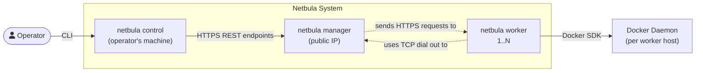
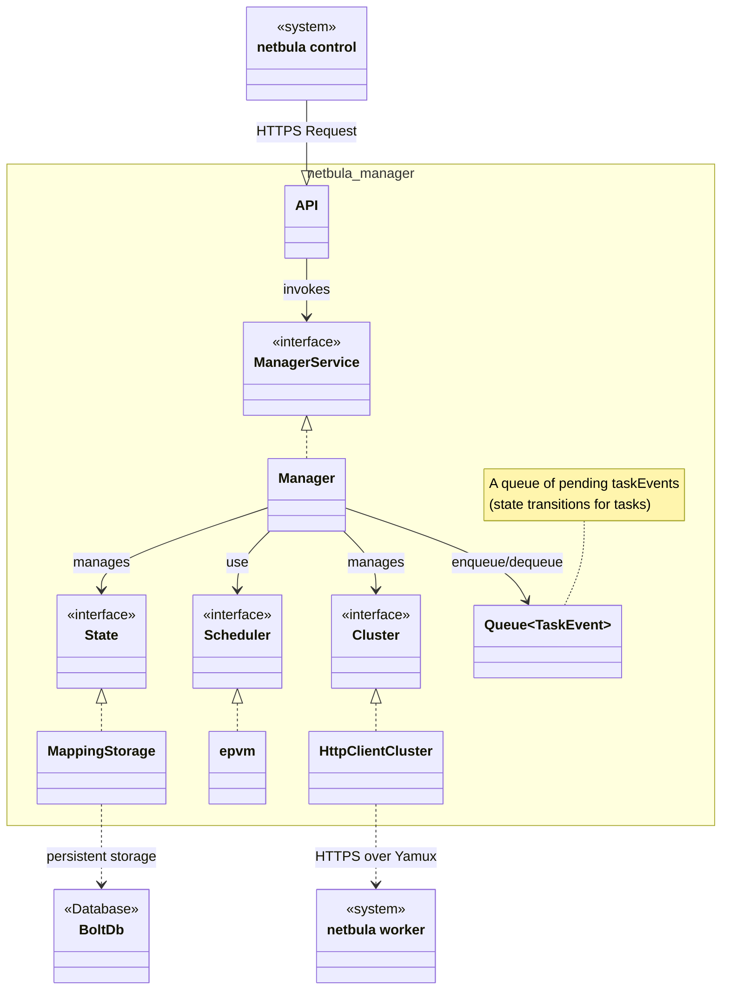
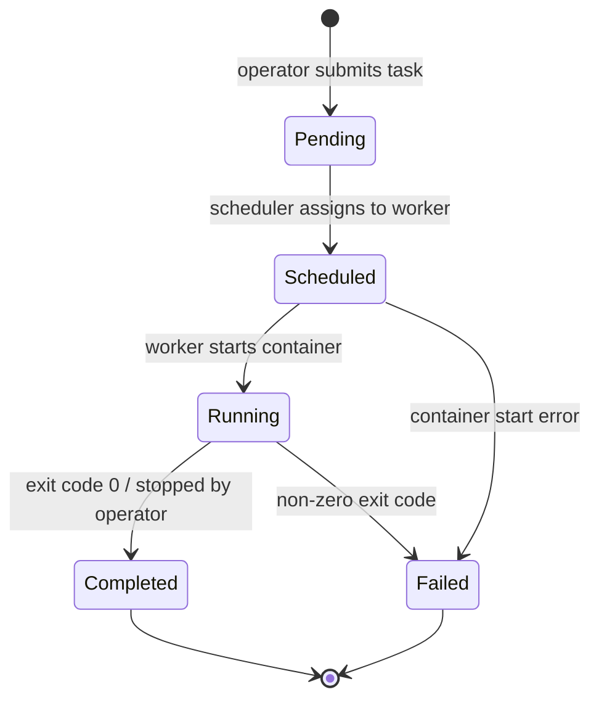
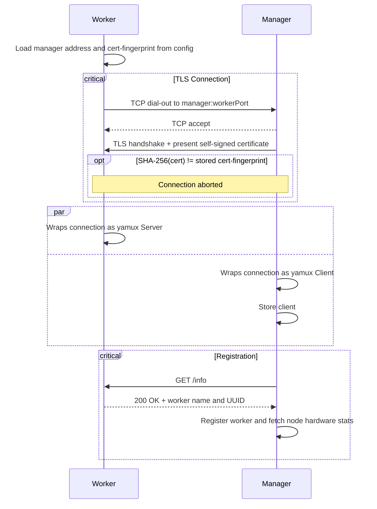
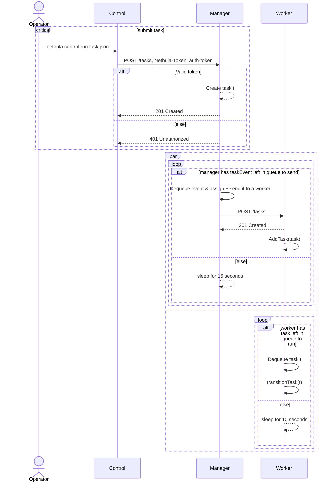

# Netbula Architecture

---

## 1. System Overview

**Architecture diagram** of Netbula.

Workers **dial out** to the manager using TCP, traversing NAT without port forwarding. The manager multiplexes HTTP requests back through these same connections using _yamux_. See [ADR 0001](adr/0001-reverse-tunneling-for-nat-traversal.md).

---

## 2. Manager Component

**Class diagram** of the manager component

---

## 3. Task Lifecycle

The **state machine diagram** modeling the state transition behavior of tasks.

Completed and Failed are terminal states. Tasks are kept in the database and never deleted.

---

## 4. Worker Registration

---

## 5. Task Submission

